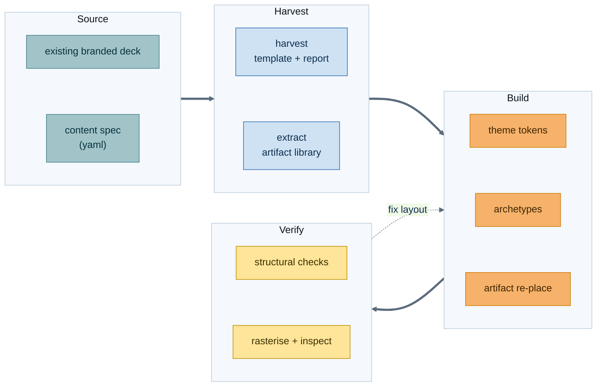

# deckforge

Turns a content-only spec into a **fully-editable `.pptx`** — every shape a native
PowerPoint shape or table that a human can select, retype and restyle. It reads
its palette, grid and type scale from a theme token file, reuses design artifacts
harvested from existing decks, and verifies what it built before you open it.

**Table of Contents**

- [1. Overview](#1-overview)
- [2. Layout](#2-layout)
- [3. Quick Start](#3-quick-start)
- [4. The Artifact Reuse Model](#4-the-artifact-reuse-model)
- [5. Deck Spec Format](#5-deck-spec-format)
- [6. Themes](#6-themes)
- [7. Harvesting a Branded Template](#7-harvesting-a-branded-template)
- [8. Verify and Render](#8-verify-and-render)
- [9. Command Reference](#9-command-reference)
- [10. Known Limitations](#10-known-limitations)

## 1. Overview

Three things separate this from a pile of `python-pptx` calls:

- **Content and design never mix.** A spec carries sections, bullets, takeaways and
  speaker notes. A theme token file carries every colour, coordinate and type size.
  Render one spec against two themes and you get the same argument on two brands.
- **Consecutive decks look like one family.** Design harvested from an existing deck —
  layouts, palette, diagram groups, SmartArt frames, tables — lands in a versioned
  artifact library that later builds pull from by name.
- **Nothing ships unverified.** Every build runs a structural pass, and rasterises the
  deck when a renderer is available, so overflow and collisions are caught before
  delivery rather than in front of an audience.

Pure Python on `pathlib`, so one command works identically on Windows, macOS and Linux.
Dependencies are `python-pptx` (the whole point) and `PyYAML` (tokens and specs).

---

## 2. Layout

```text
scripts/
├── deck.py                    # cross-platform launcher: python scripts/deck.py …
└── deckforge/
    ├── tokens.py              # theme token loader; the only source of colour and geometry
    ├── measure.py             # text metrics, so overflow is predicted before it renders
    ├── primitives.py          # grid-snapped shapes, text, bullets, tables, slide-number field
    ├── archetypes.py          # one function per slide pattern, built only from primitives
    ├── artifacts.py           # extract, index, retarget and re-place harvested design
    ├── harvest.py             # branded .pptx → slide-stripped template + design report
    ├── spec.py                # parse and validate the content spec, enforce the budget
    ├── build.py               # spec + theme + template → .pptx
    ├── verify.py              # structural checks over the saved package
    ├── render.py              # tiered rasteriser: PowerPoint → LibreOffice → none
    ├── cli.py                 # the single entry point
    └── themes/
        └── neutral.yaml       # the shipped domain-neutral theme

PRESENTATION/                  # default output root (override with --out)
├── specs/<name>.deck.yaml     # what the deck says
├── themes/<name>.yaml         # drop-in corporate tokens
├── templates/<name>.pptx      # harvested masters, layouts, theme, logo
├── artifacts/<library>/       # reusable design mined from real decks
├── <name>.pptx                # the deck
├── <name>.build.json          # what was placed, and where it came from
└── <name>_render/             # rasterised slides (git-ignored build output)
```

`deckforge/` holds *how it looks*; `PRESENTATION/` holds *what it says*. A spec that
carries a coordinate is a spec that has crossed the line, and validation rejects it.

---

## 3. Quick Start

Install the two dependencies, generate the neutral base template, build the worked
example, and look at the result.

```bash
python -m pip install python-pptx pyyaml
python scripts/deck.py doctor
python scripts/deck.py init-template
python scripts/deck.py build PRESENTATION/specs/feedback-loop.deck.yaml
```

```powershell
python -m pip install python-pptx pyyaml
python scripts\deck.py doctor
python scripts\deck.py init-template
python scripts\deck.py build PRESENTATION\specs\feedback-loop.deck.yaml
```

`build` writes the deck, verifies it and rasterises it in one pass. `doctor` tells you
which renderer tiers this machine can offer before you start.

Output lands in `<workspace>/PRESENTATION` unless you pass `--out`; point it wherever
the deck belongs:

```bash
python scripts/deck.py build PRESENTATION/specs/feedback-loop.deck.yaml --out ~/Documents/decks
```

```powershell
python scripts\deck.py build PRESENTATION\specs\feedback-loop.deck.yaml --out $HOME\Documents\decks
```

---

## 4. The Artifact Reuse Model

This is the part that makes deck number four look like deck number one.



`extract` mines a deck and writes a versioned library:

```text
PRESENTATION/artifacts/<library>/
├── manifest.json              # id, kind, source deck + slide, geometry, text slots, colours
├── outline.md / outline.json  # slide structure and titles
├── notes.md                   # every speaker note, per slide
├── tables.json                # table contents, reusable as spec content
├── colors.json / fonts.json   # what the source deck actually used
└── artifacts/<id>/
    ├── shape.xml              # the cloned shape tree
    ├── preview.txt            # its text, so you can find it by reading
    └── ppt__diagrams__*.xml   # SmartArt only: the dgm data, layout, style and colour parts
```

A later build pulls one out by name and puts it on a slide:

```yaml
- archetype: artifact
  title: The same picture, reused from the library
  content:
    artifact: group-11-the-same-picture-reused-from
    text: [Author, Signal, Review, Merge]     # retargets the text slots in order
    bullets: [Harvested once, retargeted per deck]
```

Three things happen on placement. The shape tree is deep-copied into the new slide, so
every shape stays native and editable. The text slots are retargeted in order, keeping
each run's own formatting. And explicit `srgbClr` values are remapped to the nearest
role in the active theme, while `schemeClr` references are deliberately left alone —
they already follow whatever theme the new deck carries.

Find what a library holds before you use it:

```bash
python scripts/deck.py artifacts --library PRESENTATION/artifacts/example --search chevron
```

```powershell
python scripts\deck.py artifacts --library PRESENTATION\artifacts\example --search chevron
```

The committed `example` library was mined from an earlier build of the worked example
itself, which is the intended cycle: deck *N* is extracted, and deck *N+1* is built from
what it left behind. Regenerate it after any build with
`extract PRESENTATION/feedback-loop.pptx --library PRESENTATION/artifacts/example`.

---

## 5. Deck Spec Format

YAML, not Markdown — for one decisive reason. This repo's own
[check_markdown.py](../check_markdown.py) rewrites headings, injects a table of
contents and re-aligns tables in every `.md` it touches, which would quietly mangle a
Markdown deck spec. YAML also carries nested archetype payloads (cards, panel pairs,
chevron steps, table rows) without inventing a mini-syntax, and it is schema-checkable,
so "no styling in the spec" is enforced rather than hoped for.

```yaml
deck:
  title: Shrinking the feedback loop
  subtitle: Why a two-day review cycle is a design problem
  theme: neutral
  agenda: true                  # generate the agenda slide and section dividers
  artifacts: example            # library to pull artifacts from

entities:                       # one colour per recurring entity, held deck-wide
  Handoff: alert
  Automation: primary

sections:
  - name: Where the time goes
    question: If everyone is working flat out, what is the loop waiting on?
    slides:
      - archetype: bullets
        title: A change waits far longer than it runs
        entity: Handoff
        takeaway: The loop is dominated by waiting, not by work.
        content:
          bullets:
            - Writing the change takes under an hour
            - The first automated signal arrives the next morning
        unknowns:                # never invent a number to fill a cell
          - item: Machine cost per change
            owner: Platform owner
            deliverable: Costed estimate before the trial starts
        notes: |
          The argument that does not belong on the slide lives here.
```

Archetypes available to the `archetype:` key:

| #   | Archetype   | Use for                                                   |
| --- | ----------- | --------------------------------------------------------- |
| 1   | `title`     | Slide 1 only: the promise of the deck                     |
| 2   | `agenda`    | Generated from the section list unless you override it    |
| 3   | `section`   | Divider carrying the section question and agenda progress |
| 4   | `bullets`   | A short argument, optionally under a lead line            |
| 5   | `cards`     | Two to five parallel ideas, one card each                 |
| 6   | `process`   | A left-to-right chain of steps                            |
| 7   | `panels`    | A versus B, colour-coded                                  |
| 8   | `checklist` | Do and do-not, with glyphs                                |
| 9   | `table`     | Comparison or rubric, native table, horizontal rules only |
| 10  | `artifact`  | Re-place a harvested artifact and retarget its text       |
| 11  | `statement` | One full-bleed line; closing only                         |
| 12  | `summary`   | The mandatory closing picture of the whole argument       |

The content budget is a theme token and it is enforced, not suggested: over-budget
bullets are routed into the speaker notes (or rejected, if the theme says `fail`), a
title longer than the budget is rejected rather than shrunk to fit, and a slide with
notes shorter than the minimum fails validation.

---

## 6. Themes

One human-editable YAML per theme holds the palette, semantic roles, type scale, grid
geometry, spacing and the content budget. Code reads tokens; code contains no hex value
and no coordinate.

Adding a corporate theme is two files and no Python:

1. `PRESENTATION/themes/<brand>.yaml` — copy [themes/neutral.yaml](themes/neutral.yaml),
   replace the palette with the theme colours the harvest report printed, and set
   `layouts:` to the layout indices it listed.
2. `PRESENTATION/templates/<brand>.pptx` — the harvested template, named by the theme's
   `template:` key.

Then `--theme <brand>` renders any existing spec on that brand.

```bash
python scripts/deck.py themes
python scripts/deck.py build PRESENTATION/specs/feedback-loop.deck.yaml --theme <brand>
```

```powershell
python scripts\deck.py themes
python scripts\deck.py build PRESENTATION\specs\feedback-loop.deck.yaml --theme <brand>
```

---

## 7. Harvesting a Branded Template

`harvest` copies the source to a local temporary path first (files synced from cloud
storage are often on-demand placeholders that fail to open until hydrated), strips every
slide — removing both the slide id entry and its relationship, so no dangling parts
survive — and keeps the master, layouts, theme colours, fonts and any master-level logo.

```bash
python scripts/deck.py harvest "/path/to/branded deck.pptx" --name acme
python scripts/deck.py extract "/path/to/branded deck.pptx" --library PRESENTATION/artifacts/acme
```

```powershell
python scripts\deck.py harvest "C:\path\to\branded deck.pptx" --name acme
python scripts\deck.py extract "C:\path\to\branded deck.pptx" --library PRESENTATION\artifacts\acme
```

It writes `acme.pptx` plus `acme-report.md` and `acme-report.json` listing the theme
colour scheme with hex values and theme slots, the major and minor fonts, every layout
with its index and placeholder geometry, and the position of any master-level image.
Those are exactly the numbers a theme token file needs.

---

## 8. Verify and Render

Verification is tiered so it degrades gracefully instead of failing on a machine that
has no Office:

| #   | Tier          | How                                        | Availability            |
| --- | ------------- | ------------------------------------------ | ----------------------- |
| 1   | Structural    | Reads the saved package with `python-pptx` | Always runs             |
| 2   | `libreoffice` | `soffice --headless` → PDF → `pdftoppm`    | Portable; needs both    |
| 3   | `powerpoint`  | PowerPoint automation via `comtypes`       | Windows with PowerPoint |

The report names the tier it used. The structural pass checks bounds against the canvas,
the content budget, notes length, grid alignment, a live slide-number field on every
slide, predicted text overflow, unexpected shape collisions, font-colour discipline and
that no shape is a flattened picture where a native shape was promised.

```bash
python scripts/deck.py verify PRESENTATION/feedback-loop.pptx
python scripts/deck.py render PRESENTATION/feedback-loop.pptx --dpi 110
```

```powershell
python scripts\deck.py verify PRESENTATION\feedback-loop.pptx
python scripts\deck.py render PRESENTATION\feedback-loop.pptx --dpi 110
```

`build` and `verify` exit `0` on a clean report, `2` when the deck has findings, and `1`
on an error — so a CI job can gate on them.

---

## 9. Command Reference

| #   | Command         | Does                                                        |
| --- | --------------- | ----------------------------------------------------------- |
| 1   | `doctor`        | Report render tiers, discoverable themes and output default |
| 2   | `themes`        | List every theme token file it can find                     |
| 3   | `init-template` | Generate the neutral base template from theme tokens        |
| 4   | `harvest`       | Branded `.pptx` → slide-stripped template + design report   |
| 5   | `inspect`       | Print a design report for a deck without modifying it       |
| 6   | `extract`       | Mine a deck into a versioned artifact library               |
| 7   | `artifacts`     | List or search an artifact library                          |
| 8   | `build`         | Spec → `.pptx`, then verify and rasterise                   |
| 9   | `verify`        | Check an existing deck, optionally rendering it             |
| 10  | `render`        | Rasterise a deck to PNG with the best tier available        |

Every command accepts `--workspace` and `--out`; every build-side command accepts
`--theme`.

---

## 10. Known Limitations

- **`python-pptx` cannot author SmartArt.** Real SmartArt is a `graphicFrame` pointing
  at `dgm` data, layout, style and colour parts, and there is no API for it. Two honest
  paths are supported: `process`, `cards` and `panels` **rebuild** the same layouts from
  native autoshapes, which are fully theme-recolourable; the `artifact` archetype
  **clones** a harvested SmartArt frame with its `dgm` parts and retargets its text.
  Cloned SmartArt keeps its source colours — recolouring `dgm` parts across themes is
  not reliable — and the verifier reports which slides actually carry a `dgm` graphic
  frame, so a rebuilt diagram is never mistaken for SmartArt.
- **Text metrics are estimated, not measured.** Line counts come from a per-font width
  ratio in the theme tokens, not from a font engine. It is tuned to over-estimate, so
  the visual pass remains the final word on overflow.
- **LibreOffice is not PowerPoint.** The portable tier substitutes fonts it does not
  have, so a rasterised slide shows layout truthfully and typography approximately.
- **No native charts.** There is no chart archetype: a data slide is a native table.
  A chart pasted in by hand afterwards survives a rebuild only if it is harvested into
  the artifact library first.
