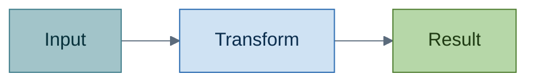

# Knowledge Doc Generator

Turn any topic — a codebase subsystem, a spec, a paper, a transcript, a half-remembered
concept — into **one Markdown file** engineered for two things only: *understand it in one
read*, and *still have it a month later*. Every structural choice below serves one of those
two goals. Prose that serves neither gets cut.

## Table of Contents

- [1. Three Hard Rules](#1-three-hard-rules)
- [2. Workflow](#2-workflow)
- [3. Document Skeleton](#3-document-skeleton)
- [4. The Story Spine](#4-the-story-spine)
  - [4.1. The Arc](#41-the-arc)
  - [4.2. Bridges and the Running Example](#42-bridges-and-the-running-example)
  - [4.3. Bottom Lines](#43-bottom-lines)
- [5. Retention Principles](#5-retention-principles)
- [6. Diagrams](#6-diagrams)
  - [6.1. Which Diagram For What](#61-which-diagram-for-what)
  - [6.2. Diagram Discipline](#62-diagram-discipline)
- [7. Formatting Is Delegated](#7-formatting-is-delegated)
- [8. Anti-Patterns](#8-anti-patterns)
- [9. Validation Checklist](#9-validation-checklist)

## 1. Three Hard Rules

These override everything else.

**Rule 1 — Every section closes with a Bottom line.** No `##` or `###` section ships without
a final one-sentence blockquote that states the takeaway. If a section has no takeaway worth
one sentence, the section should not exist — merge or delete it. Format and wording rules are
in [4.3. Bottom Lines](#43-bottom-lines).

**Rule 2 — Explain *why it exists* before *how it works*.** Open every concept with the
problem it solves and the alternative it beats. Mechanism without motivation is memorized,
not understood, and memorized things decay. If a section starts with an API signature, a
field table, or a step list, put a motivation sentence in front of it.

**Rule 3 — The document is one incremental story, not a pile of sections.** Every section
answers the question the previous section left open and raises the next one, so the reader is
pulled forward instead of restarting at each heading. Sections must be readable in order with
nothing skipped and nothing needed from ahead. Narrative order is what makes recall possible:
people remember a chain of *because* far longer than an alphabet of facts. Mechanics are in
[4. The Story Spine](#4-the-story-spine).

> **Bottom line —** No section without a takeaway, no mechanism without a motive, and no
> section that does not continue the story.

## 2. Workflow

1. **Scope.** Decide the reader and the depth before writing a word: is this an
   onboarding primer, a design rationale, or a deep reference? Ask **one** question only when
   the topic is genuinely ambiguous ("do you want the concept or this repo's implementation
   of it?"). Otherwise infer and proceed.
2. **Gather.** Read the actual sources — workspace files, vendored docs, referenced specs —
   before drafting. Prefer primary sources present in the repo over general knowledge, and
   dispatch a read-only exploration subagent when the source set is large. Never document
   behavior you have not confirmed.
3. **Outline as a story.** Write the section list first as a chain of questions, where each
   section's question is created by the previous section's answer — not as a taxonomy of
   subtopics. Pick the one running example now; it will carry through every section. Cap it
   at 5–9 top-level sections; more than that means the topic needs splitting into two
   documents. See [4. The Story Spine](#4-the-story-spine).
4. **Draft.** Fill the skeleton in [3. Document Skeleton](#3-document-skeleton), opening each
   section with its bridge sentence. Write the TL;DR **last**, once you know what the
   document actually says.
5. **Diagram.** Add a Mermaid diagram wherever the prose describes a shape — a flow, a
   hierarchy, a lifecycle, a set of relationships. See [6. Diagrams](#6-diagrams).
6. **Compress and read the spine.** Re-read and cut every sentence that restates a neighbor,
   every adjective doing no work, and every section whose Bottom line duplicates another's.
   Then read only the Bottom lines top to bottom, then only the first sentence of each
   section: both sequences must read as a continuous argument. A break in either one is a
   section in the wrong place.
7. **Validate.** Run the Mermaid validator on every diagram and the Markdown fixer on the
   file (see [7. Formatting Is Delegated](#7-formatting-is-delegated)). Fix, re-run, then
   report the file path and a two-line summary of what it covers.

> **Bottom line —** Read sources first, outline as a chain of questions, draft, then cut until
> the Bottom lines alone read as a continuous argument.

## 3. Document Skeleton

Use this order. Sections marked *optional* are dropped when they would be padding — never
kept as an empty heading.

| #   | Part              | Content                                                                                                                                               |
| --- | ----------------- | ----------------------------------------------------------------------------------------------------------------------------------------------------- |
| 1   | Title + hook      | `# Topic`, then 2–3 sentences: what it is, why anyone cares, what the reader can do after reading.                                                    |
| 2   | TL;DR             | 5–7 bullets that stand alone as the whole document in miniature. Someone who reads only this should not be misinformed.                               |
| 3   | Table of Contents | Generated by the checker — never hand-maintained.                                                                                                     |
| 4   | Mental model      | One analogy plus one Mermaid overview diagram. This is the hook memory hangs everything else on, and the map the rest of the story walks across.      |
| 5   | Core sections     | 3–7 sections, one idea each, ordered as a story. Each: bridge sentence → motivation → mechanism → the running example, one step bigger → Bottom line. |
| 6   | Contrast table    | *Optional.* The topic versus its nearest alternatives, one row per dimension that actually differs.                                                   |
| 7   | Pitfalls          | Table of `Trap` / `Why it happens` / `What to do instead` — the section readers return to most.                                                       |
| 8   | Recall drill      | 5–10 `Question:: answer` flashcard lines covering exactly the Bottom lines. Compatible with the `md-flashcards` extension.                            |
| 9   | Cheat sheet       | *Optional.* Commands, signatures, field meanings — lookup material, not explanation.                                                                  |
| 10  | Sources           | Where each claim came from: file paths with line links, doc pages, spec sections.                                                                     |

Skeleton in raw form:

````markdown
# Topic

Two or three sentences: what it is, why it matters, what you can do after reading this.

## TL;DR

- Claim that survives on its own.
- Claim that survives on its own.

## Table of Contents

<!-- generated -->

## 1. Mental Model

It behaves like *<analogy>*: <one sentence mapping the analogy onto the real thing>.



> **Bottom line —** One sentence a reader could repeat from memory tomorrow.

## 2. First Real Concept

<Bridge: name what the mental model leaves unexplained.> Then why this exists, what breaks
without it, how it works, and the running example advanced one step.

> **Bottom line —** ...

## 3. Pitfalls

| # | Trap | Why it happens | Do this instead |
| - | ---- | -------------- | --------------- |
| 1 | ...  | ...            | ...             |

> **Bottom line —** ...

## 4. Recall Drill

Answer before scrolling.

What problem does <topic> solve:: <one-line answer>
When does <mechanism> fail:: <one-line answer>

## 5. Sources

- `path/to/file.py` lines 40–95 — the implementation this document describes.
````

> **Bottom line —** Fixed skeleton, variable length: hook, TL;DR, mental model, chunked
> story sections, pitfalls, recall drill, sources.

## 4. The Story Spine

### 4.1. The Arc

A knowledge document is a story, not an index. Order the core sections so each one creates
the need for the next, following this arc — collapse beats when the topic is small, but never
reorder them:

| #   | Beat          | The section's job                                                                 |
| --- | ------------- | --------------------------------------------------------------------------------- |
| 1   | Situation     | A concrete scenario the reader already recognizes, and the question it raises.    |
| 2   | Naive model   | The simplest thing that could work, stated generously rather than as a straw man. |
| 3   | Tension       | Exactly where the naive model breaks — the reason the real design exists.         |
| 4   | Mechanism     | The design that resolves the tension, plus the price it pays for doing so.        |
| 5   | Complications | Edge cases, tradeoffs, and second-order effects the mechanism introduces.         |
| 6   | Mastery       | When to reach for it, when not to, and what to read next.                         |

The test: delete any section and a later one should stop making sense. If sections can be
shuffled without damage, the document is a list wearing a story's clothes — reorder it around
cause and effect.

> **Bottom line —** Order sections so each answer creates the next question; if they shuffle
> freely, there is no story.

### 4.2. Bridges and the Running Example

Three devices carry the story across heading boundaries:

- **Bridge sentence.** The first sentence of every section names what the previous section
  left open — "Retries recover transient failures, but only if the operation is safe to run
  twice." Never open a section with a bare definition; that resets the reader to zero.
- **One running example, growing.** Choose a single concrete example in the outline and
  advance it in every section instead of introducing a fresh unrelated one each time. The
  final section shows it complete. A reader who follows only the example must still arrive at
  a working understanding.
- **Diagrams that zoom, not restart.** Later diagrams re-show the overview with the current
  section's node highlighted, or expand exactly one of its boxes — so every picture is
  visibly part of the same map.

The story ends where lookup begins. Pitfalls, cheat sheets, and glossaries come *after* the
narrative sections and are explicitly labeled as reference, so the reader knows the argument
is over and browsing is now allowed.

> **Bottom line —** A bridge sentence, one growing example, and zooming diagrams are what make
> separate sections read as one continuous explanation.

### 4.3. Bottom Lines

Format, exactly:

```markdown
> **Bottom line —** <one sentence, ≤ 25 words, no trailing prose>
```

Rules that make it worth reading:

- **State the payload, not the topic.** "Retries are safe only when the operation is
  idempotent" — never "this section covered retries."
- **One sentence, ≤ 25 words.** If it needs two sentences, the section covers two ideas;
  split the section.
- **The sequence is the plot summary.** Read alone and in order, the Bottom lines must form a
  correct, connected account of the whole document — each one following from the last. Read
  them end to end before shipping; a non-sequitur there is a broken section order.
- **No duplicates.** Two sections with interchangeable Bottom lines are one section.
- **Feeds the recall drill.** Each Bottom line maps to one flashcard in the drill, which is
  what turns a summary line into retained knowledge.

> **Bottom line —** The Bottom lines, read alone and in order, must tell the document's story
> correctly and completely.

## 5. Retention Principles

Apply these while drafting; they are the difference between a document that is read and one
that is remembered.

| #   | Principle                | In practice                                                                                                 |
| --- | ------------------------ | ----------------------------------------------------------------------------------------------------------- |
| 1   | Concrete before abstract | Lead with a specific, real example; generalize after. Never define a term before showing it in use.         |
| 2   | Chunking                 | 3–7 items per list, 3–7 sections per document. Split anything longer; nest nothing three levels deep.       |
| 3   | Dual coding              | Pair every structural explanation with a diagram. Text plus picture is recalled far better than either.     |
| 4   | Contrast                 | Define by difference — X versus Y in a table — because boundaries are more memorable than definitions.      |
| 5   | Naming                   | Give every recurring pattern a short name and reuse it verbatim. Unnamed concepts cannot be recalled.       |
| 6   | Retrieval practice       | The recall drill is not decoration; questions the reader answers are remembered, paragraphs are not.        |
| 7   | Rationale                | Say *why* a rule exists. Rules with reasons generalize to new situations; bare rules do not.                |
| 8   | One idea per sentence    | Split any sentence with two clauses joined by "and" carrying separate facts.                                |
| 9   | Narrative order          | Chain sections by cause and effect. A story is recalled as one unit; an unordered list decays item by item. |

> **Bottom line —** Concrete first, chunked small, paired with a picture, defined by contrast,
> chained by cause, and tested by a question.

## 6. Diagrams

### 6.1. Which Diagram For What

Add a diagram when the prose describes a shape. Skip it when the prose is a definition, a
rationale, or a list of unrelated facts — a diagram of a list is noise.

| #   | The prose describes…             | Use                     |
| --- | -------------------------------- | ----------------------- |
| 1   | Steps, data flow, decisions      | `flowchart`             |
| 2   | Who calls whom, in what order    | `sequenceDiagram`       |
| 3   | Modes, transitions, lifecycle    | `stateDiagram-v2`       |
| 4   | Entities and their relationships | `erDiagram`             |
| 5   | Types, inheritance, composition  | `classDiagram`          |
| 6   | Phases over time                 | `gantt` or `timeline`   |
| 7   | Layers of a system               | `flowchart` + subgraphs |

> **Bottom line —** Match the diagram type to the shape the prose describes, and draw nothing
> when the prose has no shape.

### 6.2. Diagram Discipline

- **One overview diagram, then detail diagrams.** The mental-model diagram shows the whole
  system in under 10 nodes; later diagrams zoom into one box of it and say which box.
- **Labels are short; detail lives in the prose.** A node reads `Parse`, not
  `Parse the incoming JSON payload and validate it`.
- **Every diagram is referenced by the sentence above it**, which tells the reader what to
  look for — an unintroduced diagram gets skipped.
- **Theme, palette, and PDF-safe label rules come from the `markdown-formatting` skill.** Use
  its shared `config` frontmatter and role-based `classDef` palette verbatim in every fence so
  all diagrams in the document read as one set.
- **Validate before shipping.** Run the `mermaid-diagram-validator` tool on every diagram and
  `mermaid-diagram-preview` on the main one; an unrendered diagram is worse than no diagram.

> **Bottom line —** Diagram shapes, not lists; one overview plus zoom-ins; short labels,
> shared theme, always validated.

## 7. Formatting Is Delegated

Do not re-derive Markdown conventions here. The `markdown-formatting` skill owns them:
hierarchical dotted heading numbers, the mirror Table of Contents, aligned pipe tables with a
leading `#` row-number column, the shared Mermaid theme, and the intuition → formula →
breakdown layout for math. Follow it, then let its checker enforce the mechanical parts:

```bash
SCRIPT="$(find "$HOME/copilot-workflow-base/scripts" .github/shared/scripts -name check_markdown.py 2>/dev/null | head -n1)"
python "$SCRIPT" --fix <file>
```

The checker renumbers headings, rebuilds the TOC, and aligns tables. It does **not** write
Bottom lines, diagrams, or the recall drill — those are this skill's job, and a clean checker
run says nothing about whether the document teaches anything.

Where to save: alongside the code it explains when it documents this repo (for example
`docs/<topic>.md`); ask the user for a path only when nothing in the workspace suggests one.

> **Bottom line —** This skill owns what the document *says*; `markdown-formatting` and its
> checker own how it *looks*.

## 8. Anti-Patterns

| #   | Anti-pattern                      | Why it fails                                                    | Instead                                            |
| --- | --------------------------------- | --------------------------------------------------------------- | -------------------------------------------------- |
| 1   | Wall of prose                     | Nothing is skimmable, so nothing is re-found later.             | Chunked sections with Bottom lines.                |
| 2   | Bottom line restating the heading | Adds length, zero information.                                  | State the conclusion the section earned.           |
| 3   | Copying source code wholesale     | Goes stale immediately and explains nothing.                    | Link the file and lines; quote 3–5 pivotal lines.  |
| 4   | Diagram of a bulleted list        | Adds visual load with no structural insight.                    | Keep the list; drop the diagram.                   |
| 5   | Undefined jargon                  | Reader stalls and stops.                                        | Define on first use, or link to the definition.    |
| 6   | Documenting unverified behavior   | Confidently wrong docs are worse than none.                     | Read the source or run it; mark uncertainty aloud. |
| 7   | Exhaustive API dumps              | Reference material crowds out understanding.                    | Explain the model; link the generated reference.   |
| 8   | Ten top-level sections            | Exceeds working memory; the shape is lost.                      | Split into two documents that link to each other.  |
| 9   | Freely shuffleable sections       | No cause-and-effect chain, so nothing pulls the reader forward. | Reorder so each section answers the previous one.  |
| 10  | A new example every section       | Each restart discards the context just built.                   | Advance one running example throughout.            |

> **Bottom line —** Every anti-pattern here trades the reader's understanding for the writer's
> convenience.

## 9. Validation Checklist

- [ ] TL;DR stands alone and is accurate without the rest of the document.
- [ ] Every `##` and `###` section ends with a `> **Bottom line —**` sentence of ≤ 25 words.
- [ ] Reading only the Bottom lines, in order, yields a correct, connected account of the topic.
- [ ] Sections follow the arc — situation, naive model, tension, mechanism, complications, mastery — and cannot be shuffled without breaking.
- [ ] Every section after the first opens with a bridge sentence naming what the previous one left open.
- [ ] One running example is advanced through the document rather than replaced each section.
- [ ] Reference material (pitfalls, cheat sheet, glossary) comes after the narrative and is labeled as lookup.
- [ ] Every concept states *why it exists* before *how it works*.
- [ ] A mental-model section with an analogy and an overview diagram appears near the top.
- [ ] Every structural explanation is paired with a Mermaid diagram; no diagram merely redraws a list.
- [ ] All diagrams share the `markdown-formatting` theme and pass `mermaid-diagram-validator`.
- [ ] No section exceeds 7 list items; the document has 5–9 top-level sections.
- [ ] A pitfalls table exists with `Trap` / `Why` / `Instead` columns.
- [ ] A recall drill of 5–10 `Question:: answer` lines covers the Bottom lines.
- [ ] Every factual claim traces to a source listed in the Sources section.
- [ ] `check_markdown.py --fix` was run and the file is clean afterwards.

> **Bottom line —** Ship only when the Bottom lines alone tell the story correctly and the
> checker runs clean.
